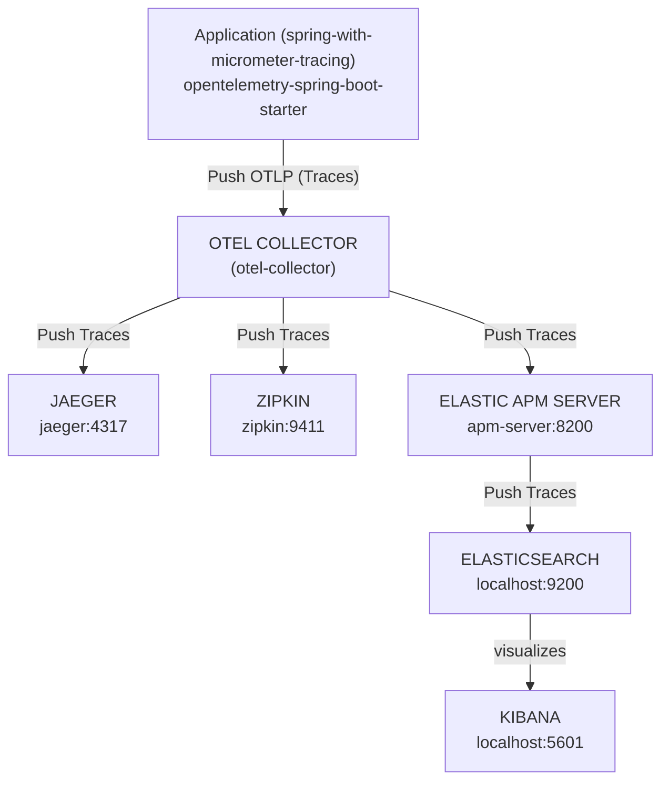
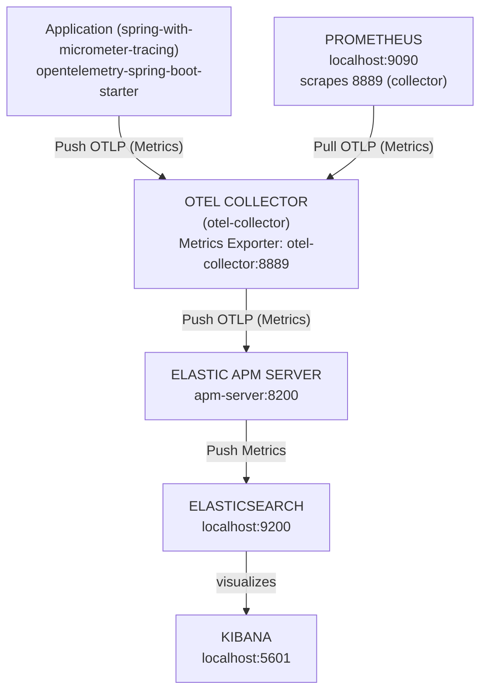
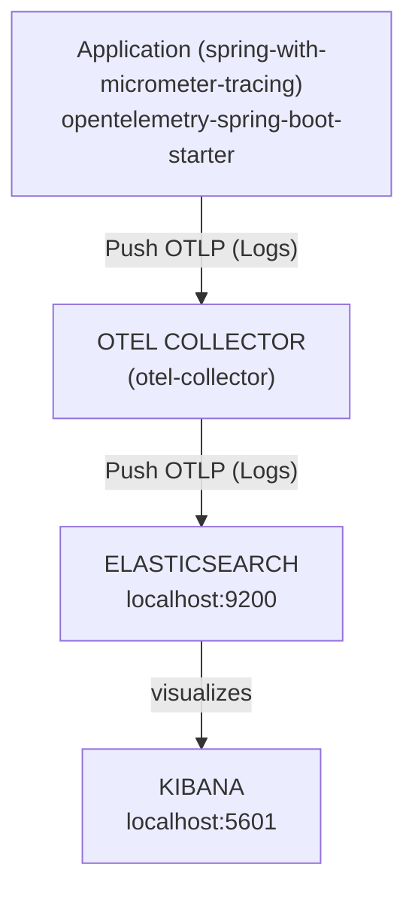

# Spring Boot with Micrometer Tracing & OpenTelemetry

Demo application based on **Spring Boot 3.5** (Java 25) that exports distributed **traces, metrics, and logs**
with **Micrometer** and **OpenTelemetry** over **OTLP**. The backends are **Jaeger** and **Zipkin** (traces),
**Prometheus** (metrics), and the **Elastic Stack** (Elastic APM, Elasticsearch, Kibana) for traces, metrics, and
logs. A Docker Compose setup starts the entire observability stack.

## Sandbox (local dev environment)

The sandbox is provisioned by the opencode-sandbox-kit and runs as a Docker container. It mounts this
repo, starts the agent, and connects the IntelliJ MCP server.

Allow the kit source (GitHub without cloning):

```powershell
sbx settings set kit.allowedSources --% "[\"docker.io/\",\"github.com/dboeckli/\"]"
```

Start a new sandbox:

```powershell
sbx run opencode `
    --kit "git+https://github.com/dboeckli/opencode-sandbox-kit.git#dir=opencode-agent" `
    --template docker/sandbox-templates:opencode-docker-0.5.0 `
    --no-share-skills `
    --static-mcp idea `
    . `
    "C:\development\maven-repo:ro"
```

Start the sandbox with Kubernetes support:

```powershell
sbx run opencode `
    --kit "git+https://github.com/dboeckli/opencode-sandbox-kit.git#dir=opencode-agent" `
    --template docker/sandbox-templates:opencode-docker-0.5.0 `
    --no-share-skills `
    --static-mcp idea `
    . `
    "C:\development\maven-repo:ro" `
    "$env:USERPROFILE\.kube:ro"
```

Claude variant (Home):

```powershell
sbx run claude `
    --kit "git+https://github.com/dboeckli/opencode-sandbox-kit.git#dir=opencode-agent" `
    --template docker/sandbox-templates:claude-code-docker-0.5.0 `
    --no-share-skills `
    --static-mcp idea `
    . `
    "C:\development\maven-repo:ro"
```

Mammouth (template pin lives in the spec image):

```powershell
sbx run "git+https://github.com/dboeckli/opencode-sandbox-kit.git#dir=mammouth-agent" `
    --no-share-skills `
    --static-mcp idea `
    . `
    "C:\development\maven-repo:ro"
```

Apply the kit to an existing sandbox (restarts the sandbox, VM state is kept):

```powershell
sbx kit add <sandbox-name> "git+https://github.com/dboeckli/opencode-sandbox-kit.git#dir=opencode-agent"
```

> **Sandbox quirk:** Before any `./mvnw` in the sandbox run `export npm_config_bin_links=false`
> (Spotless/prettier otherwise fails with EPERM on the mounted workspace).

## Observability / Monitoring Setup

This project ships a complete observability setup with **OpenTelemetry** and multiple backends.
See also: [OpenTelemetry for Spring](https://last9.io/blog/opentelemetry-for-spring/).

### Architecture Overview

#### Traces

Notes:

- Traces are sent to **Jaeger**, **Zipkin**, and **Elastic APM**
- Elastic APM writes traces **to Elasticsearch**
- Kibana visualizes traces from Elasticsearch (if enabled)



#### Metrics

Notes:

- Metrics are sent to Prometheus **and** Elastic APM
- Elastic APM writes to Elasticsearch.
- Prometheus scrapes (pulls) this data from the collector.
- Kibana visualizes data from Elasticsearch.



#### Logs



**App → OTel Collector**

The Spring Boot application exports **traces, metrics, and logs** over **OTLP HTTP** to the OTel Collector:

- OTLP HTTP endpoint of the app: `http://localhost:4318` (as seen from the host).
- Port mapping forwards this to the collector container (`otel-collector:4318`).

**OTel Collector → Backends**

The collector distributes the telemetry data as follows:

- **Traces**
  - → Jaeger (`jaeger:4317`)
  - → Zipkin (`zipkin:9411`)
  - → Elastic APM Server (`apm-server:8200`, OTLP HTTP)
- **Metrics**
  - → Prometheus exporter (`otel-collector:8889`), which Prometheus scrapes.
  - → Elastic APM Server (`apm-server:8200`, OTLP HTTP)
- **Logs**
  - → Elasticsearch (`elasticsearch:9200`), visualized via Kibana.

**Prometheus → OTel Collector**

Prometheus connects exclusively to the **collector**:

- scrape target: `otel-collector:8889`
- the application itself is **not** scraped directly via `/actuator/prometheus`.

### Services and UIs

The following UIs are available:

- **Prometheus** – metrics
  - URL: `http://localhost:9090`
  - Under `Status → Targets`, `otel-collector` should appear as "UP".
- **Jaeger** – traces
  - URL: `http://localhost:16686`
  - Search for services such as `spring-with-micrometer-tracing`.
- **Zipkin** – traces (alternative UI)
  - URL: `http://localhost:9411`
- **Elasticsearch + Kibana** – logs and (depending on APM configuration) metrics/traces
  - Elasticsearch: `http://localhost:9200`
  - Kibana: `http://localhost:5601`
    - Stack Management → Data views → APM
    - Search index pattern: `traces-apm*,apm-*,traces-*.otel-*,logs-apm*,apm-*,logs-*.otel-*,metrics-apm*,apm-*,metrics-*.otel-*`
- **Elastic APM Server** – OTLP endpoint for APM
  - OTLP HTTP: `http://localhost:8200` (mapped to `apm-server:8200` via port mapping)

